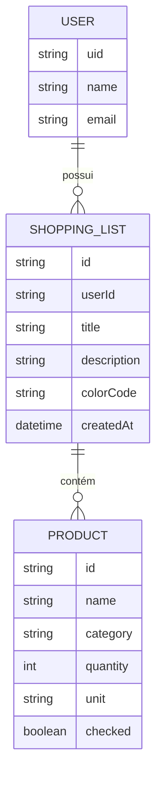

# 🌟 Novas Funcionalidades: Ecossistema Firebase & Listas de Compras

Este documento descreve as novas features propostas para a API, focando na integração com Firebase e na expansão do modelo de dados para suportar múltiplas listas de compras.

---

## 1. 🔐 Autenticação com Firebase Auth

A autenticação deixará de ser local (se existisse) para ser gerenciada pelo Firebase, garantindo segurança de nível industrial e facilidade de integração social (Google, Apple, etc.).

### O que será implementado:
- **Middleware de Autenticação:** Um middleware que interceptará o token JWT (ID Token) enviado pelo frontend no cabeçalho `Authorization: Bearer <token>`.
- **Validação com Firebase Admin:** O backend usará o `firebase-admin` SDK para verificar a validade do token.
- **Identidade do Usuário:** O `uid` extraído do token será injetado no objeto de requisição (`req.user`) para ser usado nos Use Cases.

---

## 2. 👤 Gerenciamento de Usuários (Cloud Firestore)

Utilizaremos o Cloud Firestore como banco de dados NoSQL para armazenar informações complementares dos usuários que não constam no Auth.

### Entidade Usuário:
- **Coleção:** `users`
- **Campos:**
  - `uid` (ID único do Firebase Auth)
  - `name`: Nome completo do usuário.
  - `email`: E-mail para contato.
  - `password`: Senha do usuário.
  - `createdAt`: Timestamp de criação.
  
---

## 🛒 3. CRUD de Lista de Compras (1:N)

A API evoluirá de uma "lista global" para suportar que cada usuário tenha suas próprias listas.

### Modelo de Dados:
Cada lista de compras será um documento independente que agrupa múltiplos produtos.

### Funcionalidades das Listas:
- **Criar Lista:** Define título e personalização.
- **Listar Minhas Listas:** Retorna todas as listas pertencentes ao usuário autenticado.
- **Compartilhamento (Opcional):** Estrutura preparada para permitir que mais de um `uid` tenha acesso à mesma lista.

---

## 🛠️ Arquitetura Proposta

Para manter o **Clean Architecture**, a integração será feita da seguinte forma:

1.  **Providers:** Criaremos um `FirestoreProvider` e um `FirebaseAuthProvider` em `src/infra`.
2.  **Repositórios:** Novas implementações de `IFirestoreUserRepository` e `IFirestoreListRepository`.
3.  **Use Cases:** 
    *   `CreateShoppingListUseCase`
    *   `AddProductToListUseCase` (O produto agora nasce associado a um `listId`).
    *   `ListUserShoppingListsUseCase`

## 💡 Por que Cloud Firestore?
1.  **Real-time:** Facilita a implementação de atualizações em tempo real no app se desejado futuramente.
2.  **Escalabilidade:** Escala automaticamente conforme o número de usuários e listas aumenta.
3.  **Flexibilidade:** Permite adicionar campos específicos em certos produtos ou listas sem a rigidez do schema SQL.
