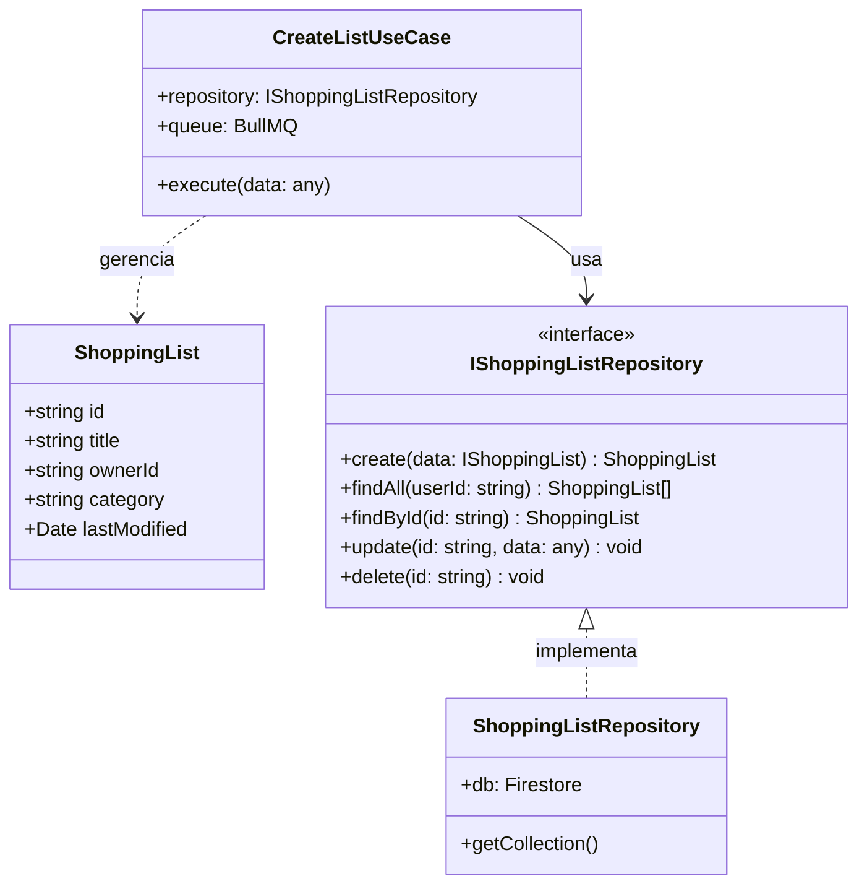
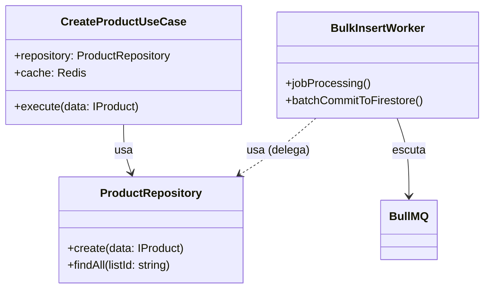
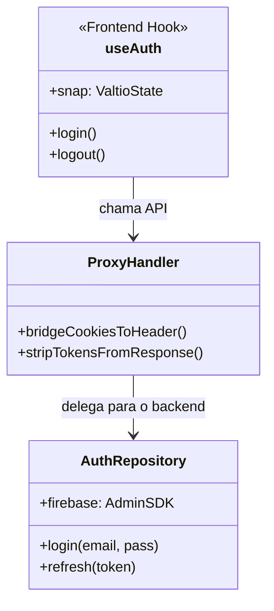

# Diagramas de Classe - Arquitetura da Lista de Compras

Este documento visualiza as relações entre entidades, repositórios e casos de uso dentro da arquitetura modular.

## 🏗️ Padrões Principais
O sistema segue um padrão de **Clean Architecture Lite**:
1. **Entidades (Entities)**: Definem a estrutura de dados e as regras de negócio.
2. **Casos de Uso (Use Cases)**: Orquestram a lógica de negócio.
3. **Repositórios (Repositories)**: Gerenciam a persistência de dados (Portas/Adaptadores).
4. **Controladores (Controllers)**: Gerenciam as requisições e respostas HTTP.

## 🛒 Estrutura do Módulo de Lista de Compras

## 📦 Relação de Produtos e Filas (Queue)

---

## 🔐 Fluxo de Autenticação (Padrão BFF)

